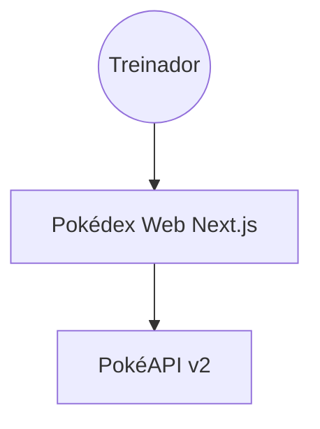
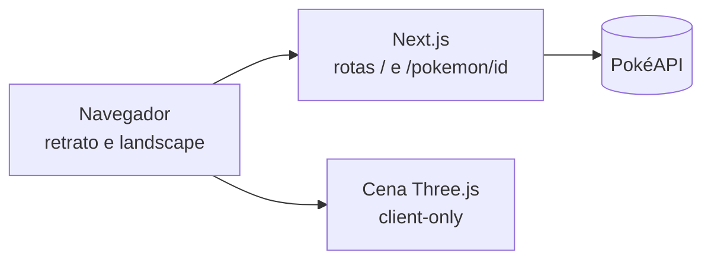
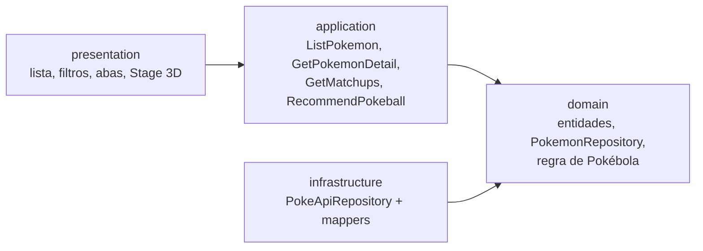

# Critérios c4e9 — Pokédex redesign (visão técnica)

## Arquitetura (C4)

### Contexto

### Containers

### Componentes

## Dados da PokéAPI por funcionalidade
| Funcionalidade | Endpoint |
|----------------|----------|
| Lista completa | `/pokemon?limit=<total>` (total vem de `count`) |
| Filtro por tipo / geração | `/type/{t}` e `/generation/{g}` (listam membros; evitam 1 chamada por Pokémon) |
| Detalhe, itens | `/pokemon/{id}` (`held_items`, `abilities`, `stats`, `types`) |
| Descrição, captura, Mega | `/pokemon-species/{id}` (`capture_rate`, `habitat`, `color`, `is_legendary`, `is_mythical`, `varieties`) |
| Evoluções | `/evolution-chain/{id}` |
| Efetividade | `/type/{t}` → `damage_relations`, combinada para tipo duplo |
| Habilidades | `/ability/{id}` (texto) |

## Regras técnicas
- Clean Architecture e Three.js conforme `constitution.md` (regras 10 e 11).
- Lista virtualizada: nenhuma renderização de ~1.000 nós DOM de uma vez.
- Cache de respostas (fetch do Next) e tratamento de erro/loading/vazio em toda chamada.
- Três.js carregado por import dinâmico, só no detalhe; fallback para imagem estática.
- Layout responsivo por `orientation` e largura: retrato empilha (palco acima, abas abaixo); landscape divide em duas colunas.

## Critérios de aceitação executáveis
| # | Critério | Verificação |
|---|----------|-------------|
| CA1 | Lista exibe todos os Pokémon retornados por `count` da API | Teste: total de itens na lista == `count` |
| CA2 | Filtrar por tipo mostra só Pokémon daquele tipo; ícones de tipo clicáveis, múltiplos filtros combináveis com geração e busca | Teste de caso de uso + teste de componente |
| CA3 | Rolar a lista mantém ≤ ~60 nós de card no DOM | Teste de componente / inspeção |
| CA4 | Detalhe tem 7 abas (Sobre, Habilidades, Evoluções, Combate, Mega, Itens, Captura) navegáveis por toque e teclado (`role=tablist`) | Teste de acessibilidade |
| CA5 | Combate: multiplicadores corretos para tipo simples e duplo (ex.: Charizard fraco 4× a Rock) | Teste unitário do caso de uso |
| CA6 | Evoluções renderizam cadeias lineares e ramificadas (ex.: Eevee) | Teste com fixtures |
| CA7 | Aba Mega mostra formas `-mega*` ou estado vazio explícito | Teste com e sem Mega |
| CA8 | Dica de Pokébola é função pura do domínio: mesma entrada → mesma saída, com motivo textual; lendário/místico nunca recebe Poké Ball comum | Teste unitário em tabela |
| CA9 | Retrato (≤ 480px) empilha; landscape divide palco e abas sem rolagem horizontal | Teste visual em 390×844 e 844×390 |
| CA10 | Cena Three.js responde a arrasto/toque, respeita `prefers-reduced-motion`, libera recursos ao desmontar e cai para imagem se WebGL falhar | Teste de componente + checagem manual |
| CA11 | Domínio e aplicação não importam React, Next, Three nem fetch | Regra de lint de dependência |
| CA12 | Estados de erro e carregamento visíveis quando a API falha | Teste com API simulada |

## Restrições e riscos
- Filtro por tipo/geração: usar `/type` e `/generation` evita ~1.000 requisições; confirmar paridade de dados com o protótipo.
- Rate limit/disponibilidade da PokéAPI: cache obrigatório.
- Desempenho do WebGL em celulares fracos: orçamento a definir na feat do Three.js (D7).
- Versões das libs a fixar via `context7` na feat-00.
