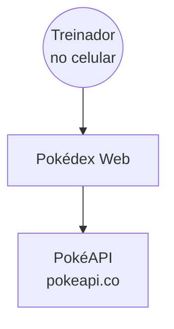
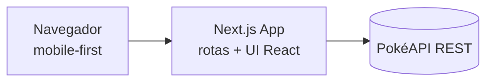
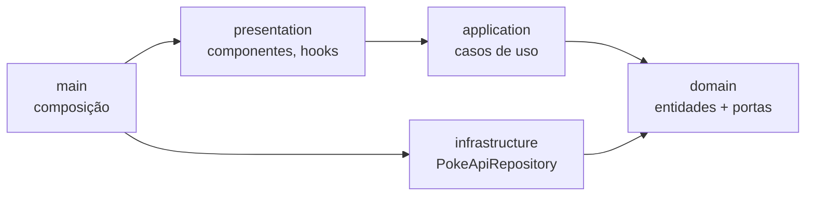

# Overview — pokemon-data

Pokédex web mobile-first em Next.js, reformulando um protótipo HTML já conectado à PokéAPI. Lista Pokémon e mostra os dados em abas legíveis, com visual fiel a uma Pokédex física. Estrutura em Clean Architecture e UI componentizada.

## Índice
- `stack.md` — tecnologias
- `modules.md` — componentes
- `flows.md` — fluxos principais
- `decisions.md` — decisões de design

---

## Arquitetura (C4 Model)

### Nível 1: Contexto

### Nível 2: Containers

### Nível 3: Componentes (camadas)

